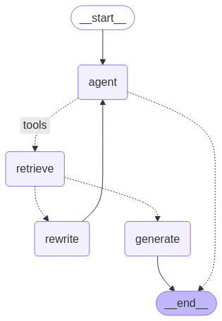

# ChatBot RAG API

  

ChatBot RAG API — это сервис чат-бота поддержки, который использует RAG Agent, LangGraph и векторное хранилище для предоставления точных и релевантных ответов на вопросы пользователей.

---

## 📌 Описание проекта

Проект реализует API-сервис чат-бота, который:
1. **Принимает текстовые запросы** от пользователей.
2. **Использует AI Агента** для коммуникации с пользователем и работы с векторным поиском
3. **Защищен от prompt injection** с помощью специальных инструкций
4. **Использует векторную базу знаний** для поиска релевантных документов.
5. **Обогащает запросы с помощью RAG** перед отправкой в LLM.
6. **Генерирует ответы** с учетом контекста и учитывает историю диалога.

---

## 🚀 Обоснованность архитектурных решений

1. **FastAPI**:
   - Выбран как современный фреймворк с высокой производительностью и автоматической генерацией документации.
   - Поддерживает асинхронные операции, что важно для интеграции с внешними API

2. **LangGraph**:
   - Используется для управления сложной системой взаимодействия агента с векторным поиском
   - Позволяет легко добавлять новые шаги (например, переписывание вопроса или оценку релевантности документов).

3. **ChromaDB**:
   - Быстрая и удобная векторная БД
   - Основна на системной библиотеке SQLite

4. **SQLite**
   - Удобна для небольшого проекта, быстро разворачивается локально
   - Используется для хранения истории диалогов

5. **OpenAI API**:
   - Используется для генерации эмбеддингов, предоставляет логику для работы AI Агента
   - Гарантирует высокое качество обработки естественного языка.
   
6. **Контейнеризация (Docker)**:
   - Упрощает развертывание и масштабирование приложения.
   - Обеспечивает изолированную среду выполнения.

7. **Режим диалога**:
   - Поддержка `thread_id` позволяет сохранять контекст между запросами, что делает взаимодействие более естественным

8. **Автоматическое обновление данных в векторной базе**:
   - API также поддерживает метод `/update-docs`, что позволяет обновить базу знаний на сервере удаленно, без необходимости перезапуска системы

9. **Авторизация по токену**:
   - Для ограничения доступа к API используется Токен Доступа, что позволяет контролировать список "клиентов" сервиса


---

## 🛠️ Логика работы

### Старт работы
Для работы с сервером клиенту в первую очередь необходимо создать `API_KEY`, который должен быть прописан в конфиге инструмента. **Каждый запрос** к серверу далее должен сопровождаться ранее созданным **`API_KEY` в заголовке запроса**, иначе сервер не будет принимать запросы

### Логика работы API

#### Описание методов
Детальное описание всех методов API можете посмотреть в файле `static/API_SCHEMA.md`. Также вы можете открыть интерфейс для тестирования API после запуска сервера, пройдя по ссылке http://127.0.0.1:8000/docs. Не забудьте указать `APIKeyHeader` в `Authorize`!

#### Обновление данных в векторной базе
Пользователь отправляет POST-запрос на `/update-docs` без тела запроса. Сервер запускать процесс сбора информации с указанного в конфиге в переменной `DOC_URL` сайта с помощью web-scrapping. После успешного обновления информации в векторной базе сервер возвращает пользователю уведомление об успешности операции.

#### Обращение к боту 
Пользователь отправляет POST-запрос на `/chat` с текстом вопроса и опциональным `thread_id`. `thread_id` используется для сохранения контекста диалога. Т.е. если вы хотите, чтобы бот помнил, о чем вы говорили до этого вам необходимо передавать ему одинаковый `thread_id`.

Далее API сервер вызывает агента и передает ему запрос пользователя на вход. Агент думает некоторое время, после чего сервер возвращает пользователю текстовый ответ системы.

### Логика работы агента
Нагляднее всего схему работы агента можно представить в следующем виде:



1. **Агент**
   - Первым делом запрос пользователя попадает в узел Агент
   - Агент подтягивает из базы историю диалога с пользователем с привязкой к `thread_id`
   - Агент решает, куда идти далее - ответить пользователю сразу или обратиться к `Retrieve Tool` для поиска информации в векторной базе
   
2. **Поиск релевантных документов**:
   - Агент перефразирует вопрос пользователя при необходимости и передает как аргумент функции поиска информации
   - Вопрос преобразуется в эмбеддинг с помощью OpenAI API
   - Выполняется поиск релевантных чанков в векторной базе

3. **Оценка релевантности**:
   - Найденные документы оцениваются на релевантность с помощью LLM
   - Если документы не релевантны, вопрос переписывается для улучшения формулировки и повторно передается на вход агенту

4. **Генерация ответа**:
   - На основе найденных документов и контекста генерируется ответ с использованием RAG.

5. **Сохранение истории**:
   - Запрос и ответ сохраняются в базе данных с привязкой к `thread_id`.

6. **Возврат ответа**:
   - Финальный ответ отправляется пользователю в формате JSON.
   - 

### Отладка
Отследить действия агента в реальном времени вы сможете на сайте https://smith.langchain.com/, указав в переменных окружения следующие параметры:
```buildoutcfg
LANGSMITH_TRACING=true
LANGSMITH_ENDPOINT="https://api.smith.langchain.com"
LANGSMITH_API_KEY=<ваш ключ проекта>
LANGSMITH_PROJECT="console_pro_exam"
```

---

## 📦 Структура проекта

```
сonsole_pro_exam/
├── app/
│   ├── __init__.py          # Инициализация приложения
│   ├── api/                 # API сервера
│   │   ├── routes/          # Маршруты API
│   │   │   └── chat.py      # Маршрут /chat
│   │   │   └── scrapping.py # Маршрут /update-docs
│   │   └── schemas.py       # Схемы запросов и ответов для API
│   ├── core/                # Конфигурация и аутентификация
│   │   ├── config.py        # Настройки (.env)
│   │   └── auth.py          # Аутентификация
│   └── services/            # Бизнес-логика
│       └── knowlage_base.py # Обновление документов векторной БД
│       └── rag_pipeline.py  # RAG-пайплайн
├── data/                    # Данные (векторы, история диалога)
├── static/                  # "Статические" файлы проекта
├── tests/                   # Тесты
├── Dockerfile               # Dockerfile для контейнеризации
├── docker-compose.yml       # Конфигурация контейнера Docker
├── requirements.txt         # Зависимости Python
├── .env.example             # Пример файла конфигурации
├── README.md                # Этот файл
└── main.py                  # Точка входа в приложение
```

---

## 🛠️ Установка и запуск

### 1. Клонирование репозитория
```bash
git clone https://github.com/kykazabra/console_pro_exam.git
cd console_pro_exam
```

### 2. Установка зависимостей
```bash
pip install -r requirements.txt
```

### 3. Настройка переменных окружения
Создайте файл `.env` на основе `.env.example`:
```env
API_KEY=test_api_key  # Секретный ключ для авторизации в приложении

USER_AGENT=my_agent

OPENAI_API_KEY=sk-...  # Ваш ключ от API OpenAI
OPENAI_API_URL=https://api.proxyapi.ru/openai/v1  # Адрес сервера API OpenAI
OPENAI_LLM_MODEL=gpt-4o  # Предпочитаемая для работы приложения модель

# Настройки langsmith для отладки агента
LANGSMITH_TRACING=true
LANGSMITH_ENDPOINT="https://api.smith.langchain.com"
LANGSMITH_API_KEY=...
LANGSMITH_PROJECT="console_pro_exam"

SQLITE_PATH=data/duckdb_store.db
CHROMA_PATH=data/chroma_store

DOC_URL=https://help.konsol.pro/  # Адрес страницы с документацией
```

P.S. Ключи API в России можете получить по этой ссылке - https://console.proxyapi.ru/.

### 4. Запуск приложения
#### Без Docker:
```bash
python main.py
```

#### С Docker:
```bash
docker-compose build
docker run -d -p 8000:8000 --name chatbot-container chatbot-rag-langgraph
```

---

## 📝 Пример запроса

### POST /chat
```bash
curl -X POST "http://localhost:8000/chat" \
-H "Authorization: Bearer YOUR_API_KEY" \
-H "Content-Type: application/json" \
-d '{
  "question": "Как оформить контракт с исполнителем?",
  "thread_id": "optional_thread_id"
}'
```

### Пример ответа:
```json
{
  "answer": "Для оформления контракта с исполнителем вам необходимо...",
  "thread_id": "optional_thread_id"
}
```

---

## 🔧 Тестирование

Запустите тесты с помощью `pytest`:
```bash
pytest tests/
```

---

## 📈 Возможности для улучшения

1. **Масштабируемость**:
   - Добавить поддержку распределенной базы данных (например, PostgreSQL).
   - Интегрировать кэширование (Redis) для ускорения поиска.

2. **Интерфейс пользователя**:
   - Разработать веб-интерфейс для удобного взаимодействия с ботом.

3. **Аналитика**:
   - Добавить сбор статистики по запросам и ответам.

4. **HTTPS**:
   - Настроить Let's Encrypt для безопасного соединения.

---

## 📄 Лицензия

Этот проект распространяется под лицензией [MIT](LICENSE).

---

## 🙏 Благодарности

- [LangChain](https://www.langchain.com/) за мощные инструменты для работы с LLM.
- [FastAPI](https://fastapi.tiangolo.com/) за быстрое создание API.
- [DuckDB](https://duckdb.org/) за компактное и производительное хранилище данных.

---

Если у вас есть вопросы или предложения, свяжитесь с автором: [your-email@example.com](mailto:your-email@example.com).